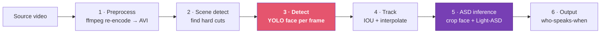

  

    

      pixelml · VIDEO INTELLIGENCE
    

    <h1 style="color:white; border-left:4px solid rgba(255,255,255,0.5); padding-left:1rem; font-size:2rem; margin:0 0 0.5rem; line-height:1.25; background:none; border-radius:0; margin-left:0; width:auto; max-width:100%; padding-right:0;">
      Active Speaker Detection How It Works &amp; Why It's Slow
    </h1>
  

  

    

      The bottleneck component of long-to-short 
      Team meeting — Friday, 2026-07-17
    

    

      102-min HD benchmark
      NVIDIA A10
      Honest numbers
    

  

---

# The stakes

Product

<strong>Long-to-short</strong> turns long videos into short clips. To pick who to keep on screen, it must know <strong>who is speaking, when</strong>. That job is <strong>ASD</strong> — and ASD is the slow part.

Customer ask

<strong>1 hour of video in 5 minutes</strong> of processing = <strong>12× realtime</strong>. Reference point: Twelve Labs reportedly does a 30-min video in under a minute (&gt;30×). So 12× is physically real.

<strong>Where we are today</strong>

  
1.04×real 102-min HD

  
12×target

Gap is <strong>~12×, not 6×</strong>. This deck explains exactly where those minutes go — and why the usual fixes (bigger GPU, faster model) will not move them.

<!--
Frame: this is not "the model is heavy". It's an I/O-shaped problem. Hold that thought.
-->

---
class: layout-section-pixelml
---

  
SECTION 01

  <h1 style="color:white;border-left:4px solid rgba(255,255,255,0.5);padding-left:1rem;font-size:2rem;margin:0 0 0.5rem;line-height:1.25;background:none;border-radius:0;margin-left:0;width:auto;max-width:100%;padding-right:0;">
    How ASD Works
  </h1>
  
Six stages, one video, many passes

---
zoom: 0.9
---

# The pipeline: six stages

Audio and video are fused only at <strong>stage 5</strong>: the model watches a mouth crop and listens to the matching audio to decide "speaking or not". Everything before it just <strong>finds and follows faces</strong>.

<strong>Read this now:</strong> the rose stage (Detect) is 68% of the time. The purple stage (the actual model) is ~3%.

---
zoom: 0.86
---

# What each stage actually does

| #   | Stage             | Job                                                          | Cost driver                                |
| --- | ----------------- | ------------------------------------------------------------ | ------------------------------------------ |
| 1   | **Preprocess**    | ffmpeg re-encodes source to a uniform AVI                    | Full re-encode, superlinear on length      |
| 2   | **Scene detect**  | PySceneDetect finds hard cuts (shot boundaries)              | One decode pass                            |
| 3   | **Detect**        | YOLOv11-face finds face boxes, **every frame**               | Decode + per-frame CPU prep → **the wall** |
| 4   | **Track**         | IOU matching links boxes into face tracks; interpolates gaps | Trivial (0.5 s)                            |
| 5   | **ASD inference** | Crop each tracked face, run **Light-ASD** on crop + audio    | A *second* full decode, then the model     |
| 6   | **Output**        | Emit who-speaks-when timeline                                | Trivial                                    |

Note stages 2, 3, and 5 each <strong>decode the whole video again</strong>. The video is read start-to-finish <strong>4–5 times</strong> across one run.

---
zoom: 0.8
---

# Inside the Detect stage (the 68%)

  

The one GPU box sits alone in an idle lane while every other step stacks on the CPU. That picture <strong>is</strong> the bottleneck — the roundtrip, not the math.

<!--
Key teaching moment: the GPU forward is one line in a five-line loop, and it's the only line the GPU touches.
Walk left-to-right, then point at the two red crossing arrows: that's where the video's minutes go.
-->

---
class: layout-section-pixelml
---

  
SECTION 02

  <h1 style="color:white;border-left:4px solid rgba(255,255,255,0.5);padding-left:1rem;font-size:2rem;margin:0 0 0.5rem;line-height:1.25;background:none;border-radius:0;margin-left:0;width:auto;max-width:100%;padding-right:0;">
    Why It's Slow
  </h1>
  
Measured on hardware, not guessed

---
zoom: 0.86
---

# The 102-minute run, measured

  
98.5 minto process 102 min

  
1.04×realtime

  
153,330frames

  
553face tracks

| Stage          | Time         | Share     | Note                                              |
| -------------- | ------------ | --------- | ------------------------------------------------- |
| **Detect**     | **4025.8 s** | **68.1%** | 38.1 fps — the whole game                         |
| ASD inference  | 1185.3 s     | 20.1%     | ~1012 s is a *second* decode; model itself ~152 s |
| Preprocess     | 424.8 s      | 7.2%      | ffmpeg re-encode (7m22s)                          |
| Scene detect   | 264.7 s      | 4.5%      | 369 scenes                                        |
| Track / Output | ~10 s        | 0.2%      | negligible                                        |

The <strong>model</strong> — the part everyone worries about — is <strong>2.6% of total time</strong>.

---
zoom: 0.88
---

# The smoking gun: the GPU is idle

During the 35-minute Detect stage we watched the GPU with <code>nvidia-smi dmon</code>. Every counter was zero:

sm   0   ← compute idle 
dec  0   ← NVDEC decoder unused 
enc  0 
mem  3.9 / 23 GB

Meanwhile <strong>one CPU core sat pinned at 100%</strong>. The A10 was a very expensive spectator.

What this proves

<ul style="font-size:0.82rem;margin-top:0.3rem;">
<li><code>dec 0</code> → "GPU decode" is <strong>fake</strong>; decode is pure CPU PyAV</li>
<li><code>sm 0</code> → the GPU does almost no compute during 68% of the run</li>
<li>The bottleneck is <strong>moving pixels to/from the CPU</strong>, not math</li>
</ul>

Detect ≈ <strong>~1000 s decode + ~3000 s (50 min)</strong> of per-frame CPU prep &amp; roundtrip.

---
zoom: 0.9
---

# Three myths to retire on Friday

| Belief                                         | Verdict     | The number                                  |
| ---------------------------------------------- | ----------- | ------------------------------------------- |
| "TalkNet / Light-ASD fusion is the bottleneck" | ❌ **False** | Model is **~2.6%** of total                 |
| "A bigger GPU will fix it"                     | ❌ **False** | GPU is **0%** busy during the 35-min Detect |
| "The read is the bottleneck"                   | ✅ **True**  | Decode + CPU roundtrip **dominate**         |

<strong>Why the model myth persists:</strong> the fusion model <em>looks</em> heavy — audio + video, cross-attention. But it runs on tiny mouth crops and finishes in ~152 s across all 553 tracks.

<strong>The instinct that was right:</strong> "the read is the problem." Correct. We just hadn't proven it with counters until now.

---
zoom: 0.86
---

# "But we already batched YOLO..."

True — the YOLO forward is <strong>already batched</strong> (32 frames at a time). So why no speedup?

Because batching accelerates the <strong>one step that was never the bottleneck</strong> — the GPU forward. The 50 minutes live in the per-frame CPU work <strong>around</strong> it:
<ul style="margin-top:0.4rem;">
<li>decode</li>
<li><code>.cpu()</code> roundtrip + BGR copy</li>
<li>Ultralytics letterbox</li>
<li>NMS</li>
</ul>
None of those are helped by a bigger batch.

<strong>Proof:</strong> if batching had moved the wall, we'd see <code>sm &gt; 0</code>. We saw <code>sm = 0</code>. The GPU was still idle.

<strong>Consequence:</strong> raising <code>--yoloBatchSize</code> does nothing. Only <strong>striding</strong>, <strong>downscaling</strong>, and <strong>feeding GPU-resident tensors</strong> move Detect.

---
zoom: 0.88
---

# Two hidden taxes

Tax 1 — decode 4–5×

The video is decoded start-to-finish in <strong>preprocess, scene, detect, and asd</strong> (plus visualization). Since decode <em>is</em> the bottleneck, we pay the bottleneck several times per run.

Tax 2 — the second decode

The ASD stage looks like "20% model time". It isn't — <strong>~1012 s of its 1185 s is a whole second decode</strong> to fetch crops. The model is the small remainder.

<strong>The 7-minute fixture lied to us.</strong>

  
1.96×7-min fixture

  
1.04×real 102-min HD

Detect fps <strong>halved</strong> (71.6 → 38.1) purely from resolution — full-res frames, and <code>facedetScale</code> is unused. Resolution is a first-class cost the code currently ignores.

---
class: layout-section-pixelml
---

  
SECTION 03

  <h1 style="color:white;border-left:4px solid rgba(255,255,255,0.5);padding-left:1rem;font-size:2rem;margin:0 0 0.5rem;line-height:1.25;background:none;border-radius:0;margin-left:0;width:auto;max-width:100%;padding-right:0;">
    The Path to 12×
  </h1>
  
Ordered by leverage

---
zoom: 0.84
---

# Fix roadmap

| #   | Fix                           | What it does                                                                                       | Status                              |
| --- | ----------------------------- | -------------------------------------------------------------------------------------------------- | ----------------------------------- |
| 1   | **Strided detection**         | Run YOLO every ~10th frame; `track_shot` already interpolates gaps; scene cuts anchor re-detection | Designed, **never shipped**         |
| 2   | **Downscale-on-decode**       | Feed detection-resolution frames, not full HD — biggest HD lever                                   | `facedetScale` **unused**           |
| 3   | **True NVDEC + GPU tensors**  | Kill the `.cpu().numpy()` roundtrip; hand YOLO GPU-resident frames                                 | Lights up `dec`, frees the CPU core |
| 4   | **Drop the ffmpeg re-encode** | Decode source directly; normalize fps only if needed                                               | Removes 7m22s + faster decodes      |
| 5   | **Decode once, reuse**        | One GPU-resident pass feeds detect + crop + scene                                                  | Kills taxes 1 &amp; 2               |
| 6   | **Shrink ASD compute**        | `durationSet [1..6]` → `[1,2]`                                                                     | Optional; it's only ~3%             |

No single fix reaches 12×. Striding alone ≈ 2×. The target needs the <strong>full stack</strong> — striding <em>and</em> downscale <em>and</em> the GPU decode path.

---
zoom: 0.88
---

# What we promise the customer

Safe now

<strong>Throughput via sharding.</strong> Long-to-short is embarrassingly parallel — across videos and across scene cuts. Fan N videos/scenes across GPUs and hit an aggregate "hour-in-5-min" SLA <strong>today</strong>, before single-video latency is solved.

Then

Ship fixes 1–3 to bring <strong>single-video</strong> latency toward 12× and cut the GPU bill per video.

<strong>One-line takeaway</strong>

ASD is slow because it <strong>reads the video 4–5 times on one CPU core while the GPU watches</strong>. Fix the reads — stride, downscale, decode on the GPU — not the model, not the GPU size.

Reads, not math
the whole story in three words

---
class: layout-section-pixelml
---

  

    <h1 style="color:white; font-size:2.2rem; font-weight:700; margin:0 0 0.5rem; background:none; border-radius:0; margin-left:0; width:auto; max-width:100%; padding:0; border:none;">
      Fix the reads.
    </h1>
    
Detect is 68%, the GPU is idle, the model is 3%. Now we know where to dig.

  

